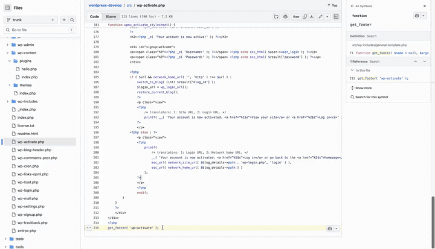

# Decode

> Highlight any code on the web → get a plain-English explanation. Powered by Claude.

Decode is a browser extension built for people learning to code.

- **Install (developer mode):** [Latest release](https://github.com/makdia/Decode/releases/latest)
- **Source code:** <https://github.com/makdia/Decode>
- **Privacy policy:** [/privacy/](/Decode/privacy/)
- **Report a bug:** <https://github.com/makdia/Decode/issues>

  

